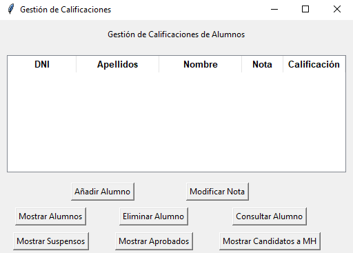

# Sistema de Gestión de Calificaciones de Alumnos

Este proyecto es una implementación en Python de un sistema de gestión de calificaciones para un grupo de estudiantes. Permite gestionar la información de los estudiantes, incluyendo su DNI, apellidos, nombre, nota y calificación.

La calificación se calcula automáticamente con base en la nota asignada por el profesor, utilizando las siguientes reglas:

**SS**: Nota < 5
**AP**: 5 ≤ Nota < 7
**NT**: 7 ≤ Nota < 9
**SB**: Nota ≥ 9

## Vista Previa 👀

    

## Requisitos 📝

Para la versión en Python:
- Debes tener Python instalado si deseas ejecutar el código fuente.

Para la versión ejecutable (`.exe`):
- No es necesario tener Python instalado.

## Instalación y Ejecución 🛠️

***Opción 1***: Ejecutar desde el código fuente
- Clona el **repositorio**.
- Abre el código en tu editor de texto o IDE favorito.
- Ejecuta el programa con **Python**.

***Opción 2***: Descargar el archivo ejecutable ⬇️
- Dirígete a la sección **dist** del proyecto.
- Descarga el archivo **sistema_calif.exe** disponible.
- Haz doble clic sobre el archivo **sistema_califa.exe** para iniciar la app.
